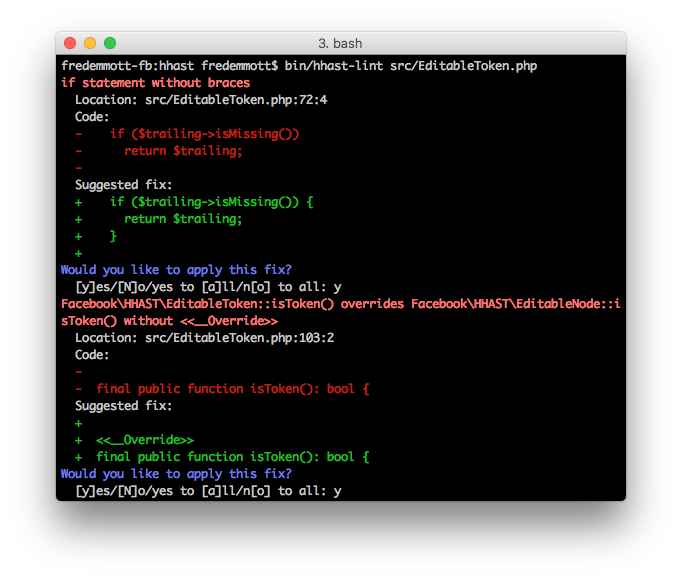
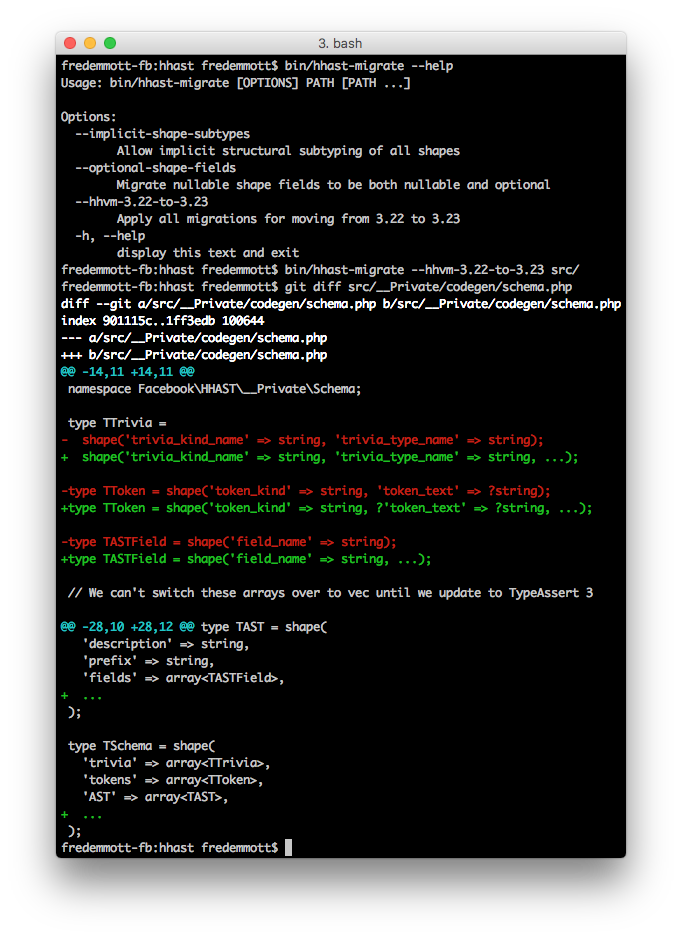

# HHAST

HHAST is a toolkit for processing the AST of Hack files.

Abstract syntax trees can be an extremely powerful basis for many kinds of tooling beyond compilers and optimization; HHAST is built on top of Hack's Full Fidelity Parser (FFP), providing a Hack object representation of a *mutable* AST.

Unlike traditional ASTs, the FFP's AST includes all 'trivia' - such as whitespace and comments - allowing you to fully recreate the file from the AST, or create an updated file after mutating the AST, preserving comments and whitespace.

HHAST has 3 main APIs:

* a low-level library for inspecting and manipulating the FFP AST
* a linting framework, with support for auto-fixing linters
* a migration framework

## Linters

[user documentation](docs/linters-usage.md)

Linters are designed for subjective or style changes which do not substantially alter the behavior of the code, and may be rejected on a case-by-case basis. Lint errors can provide a suggested fix, which may be based on an AST mutation, but doesn't have to be.

We've included several linters as a starting point, including:

* don't use await in a loop
* methods should be ->lowerCamelCase(), functions should be under_scored()
* always use braces for control flow
* always use [`<<__Override>>`](https://docs.hhvm.com/hack/attributes/special#__override) where possible

Linters can be used both interactively, or unattended. Autofixing is not supported unattended, however it will exit with non-zero if there are any lint issues, to ease integration with CI systems.

## Migrations

Migrations are for sweeping changes you want to apply across your entire codebase, and are often more complex. Taking this into account, the migration framework has built-in support for multi-step migrations (unlike linters). AST-aware migrations can be a powerful tool for:

* adjusting for changes to the language (for example, the shape changes described below)
* replacing deprecated APIs with new ones
* general clean-up of the codebase

## Low-level AST library

See [the documentation](doc/ast-lib.md).

## License
HHAST is BSD-licensed. We also provide an additional patent grant.
