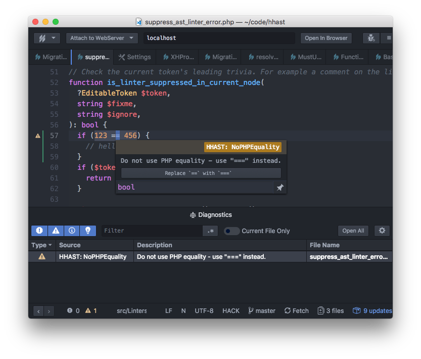
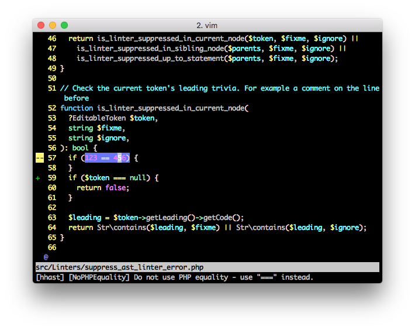
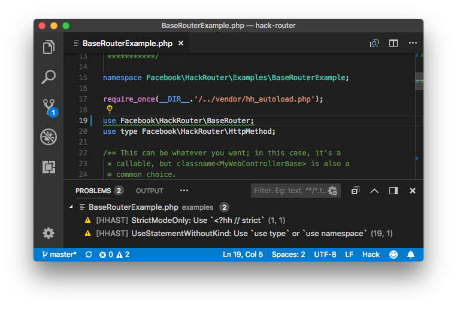

# HHAST: Linters

## Quick Start

```
php composer.phar require hhvm/hhast
vendor/bin/hhast-lint src/
```

PHP must be used to execute composer, not HHVM.

This will run a default set of linters against your source tree. If you do not have a configuration file, paths must be specified on the command line.

## Configuration

An `hhast-lint.json` in your project root can be used to modify which linters are used, or to otherwise customize the behavior. A minimal configuration would be:

```
{
  "roots": [ "src/" ]
}
```

This would configure `hhast-lint` with no arguments check `src/` with otherwise-default settings. For information on additional options, see [`LintRunConfig::TConfigFile`](../src/__Private/LintRunConfig.hack).

Options can also be overriden for specific file patterns or subdirectories - for example, [HHAST itself](../hhast-lint.json) disables autofixes for `codegen/`.

## Suppressing Lint Errors

An individual error can be suppressed by adding a comment containing
`HHAST_FIXME[LinterName]` or `HHAST_IGNORE_ERROR[LinterName]` before the
affected statement or expression (usually on the previous line). The comment
should also contain an explanation.

```hack
// HHAST_FIXME[UnusedVariable] planning to use this later
$answer = 42;
```

`HHAST_FIXME` and `HHAST_IGNORE_ERROR` behave identically, choose between them
based on which one better explains the reason for suppressing the linter.

You can suppress all lint errors of a specific type in one file by adding a
comment containing `HHAST_IGNORE_ALL[LinterName]` anywhere in the file.

## Editor and IDE Support

Editor and IDE integration requires executing `vendor/bin/hhast-lint` when a `.hhconfig` and
`hhast-lint.json` is present; if you do not trust the repositories you edit code in, this may be a
security risk.

## Atom IDE and Nuclide



The `ide-hhast` package ([atom-ide-hhast]) shows lint errors, and provides the
option to fix many automatically.

This plugin will prompt before executing `vendor/bin/hhast-lint` for each project.
The `atom-ide-ui` package is required, unless using Nuclide.

### Vim8 and Neovim



Install [vim-hack] and [ALE]; `vim-hack` provides filetype detection and syntax highlighting, and ALE
provides support for more advanced features, including HHAST lint error reporting.

To enable HHAST support, add `let g:ale_linters = { 'hack': ['hack', 'hhast'] }` to your `.vimrc`. Note
that this will execute `vendor/bin/hhast-lint` in any project, without further prompting.

### Visual Studio Code




Install [vscode-hack]; this provides a rich experience for Hack and HHAST, including lint error reporting
and autofixing.

This plugin will prompt before executing `vendor/bin/hhast-lint` for each project.

- [atom-ide-hhast] for Atom IDE and Nuclide
- [vscode-hack] for Visual Studio Code

[atom-ide-hhast]: https://github.com/hhvm/atom-ide-hhast/
[ALE]: https://github.com/w0rp/ale/
[vim-hack]: https://github.com/hhvm/vim-hack/
[vscode-hack]: https://marketplace.visualstudio.com/items?itemName=pranayagarwal.vscode-hack
